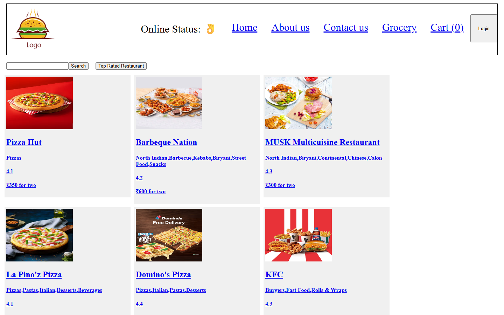
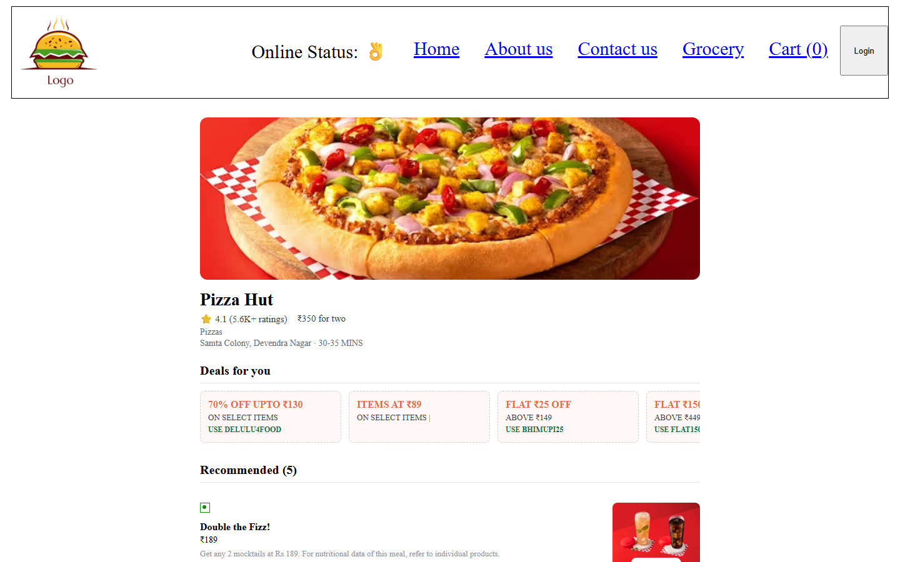

# Namaste React — Swiggy Clone

A React 18 clone of Swiggy's restaurant listing and menu pages, built while following the
[Namaste React](https://www.youtube.com/playlist?list=PLlasXeu85E9cQ32QqCUEqR6r5F1jt2Vhx) course by Akshay Saini.

Live restaurant and menu data is pulled from Swiggy's public API through a small local
Express proxy (needed to get around CORS/user-agent restrictions on direct browser calls).

## Screenshots

| Restaurant listing | Restaurant menu |
| --- | --- |
|  |  |

## Features

- Restaurant listing with search and a "top rated" filter
- Restaurant menu page with items, prices, ratings and offers
- Cart powered by Redux Toolkit (add/remove items, cross-restaurant cart warning)
- Lazy-loaded `About` and `Grocery` routes via `React.lazy` + `Suspense`
- Online/offline detection
- Client-side routing via `react-router-dom`

## Prerequisites

- Node.js 18+
- npm

## Getting started

```bash
npm install
npm run dev
```

`npm run dev` starts both processes together:

- the Express API proxy on **http://localhost:5000**
- the Parcel dev server on **http://localhost:1234**

Open **http://localhost:1234** in your browser.

If you'd rather run them separately (e.g. in two terminals):

```bash
npm run server   # Express proxy on :5000
npm start        # Parcel dev server on :1234
```

## Other scripts

```bash
npm run build   # production build (dist/)
npm test        # run Jest tests
```

## Project structure

```
index.html            entry HTML, mounts src/App.js
server.js             Express proxy for Swiggy's restaurant/menu APIs
src/
  App.js              router setup, top-level layout
  components/          UI components (Header, Body, RestaurantMenu, Cart, ...)
  utils/               Redux store/slice, custom hooks, constants
```

## Why the proxy server?

Swiggy's API blocks direct browser requests (CORS + bot checks). `server.js` forwards
requests to `swiggy.com` from Node with the headers it expects, and re-serves the JSON
to the React app on `localhost:5000`.
